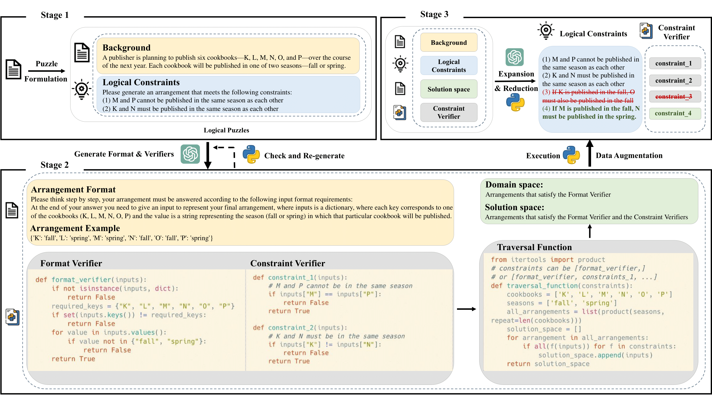

# AutoLogi

Este repositorio contiene la implementación oficial del artículo [**"AutoLogi: Automated Generation of Logic Puzzles for Evaluating Reasoning Abilities of Large Language Models"**](https://arxiv.org/abs/2502.16906).

## Información Básica



Nuestro método automatizado para sintetizar acertijos lógicos abiertos consta de tres etapas: la Etapa 1 formula acertijos lógicos extrayendo información de fondo y restricciones de un corpus de origen. La Etapa 2 utiliza modelos de lenguaje extensos (LLMs) para generar verificadores, que son programas que comprueban las soluciones de los acertijos y aseguran el formato correcto. La Etapa 3 aumenta los acertijos añadiendo o eliminando restricciones para crear niveles de dificultad variables. Las tres etapas aprovechan LLMs potentes, como GPT-4, para la generación.

|  | D<sub>testing</sub> | D<sub>training</sub> | D<sub>dpo</sub>(7b) | D<sub>dpo</sub>(72b) | D<sub>sft</sub>(72b) |
|:---:|:-------------------:|:-------------------:|:-------------------:|:--------------------:|:-------------------:|
| **EN** | 1575                | 5064                | 2877                | 2349                 | 3724                |
| **CN** | 883                 | 1675                | 901                 | 621                  | 1170                |

La tabla anterior presenta una descripción estadística detallada del conjunto de prueba sintético (D<sub>testing</sub>) y de los diversos conjuntos de datos de entrenamiento utilizados. 

## DATOS

### Datos del Benchmark
Los datos de evaluación del benchmark AutoLogi están disponibles en:
- `/testing-data/AutoLogi_en.jsonl` (Inglés)
- `/testing-data/AutoLogi_cn.jsonl` (Chino)

### Datos de Entrenamiento
Ubicados en `/training-data/`:
- `source_corpus_cn.jsonl` y `source_corpus_en.jsonl`: Datos de origen como entrada.
- `synthesized_data_cn.jsonl` y `synthesized_data_en.jsonl`: Datos generados a partir del corpus de origen utilizando nuestro método de síntesis.
- Datos de SFT y DPO obtenidos mediante muestreo de rechazo (rejection-sampling) utilizando:
  - Qwen2.5-72b-instruct
  - Qwen2.5-7b-instruct

Para una implementación detallada del proceso de muestreo de rechazo, consulte nuestro artículo.

## Evaluación

### Inicio Rápido

#### Paso 1: Generar Respuestas del Modelo
Utilice el campo 'prompt' en `/testing-data/AutoLogi_en.jsonl` y `/testing-data/AutoLogi_cn.jsonl` como entrada para su modelo. Almacene las salidas del modelo en el campo 'gen' como una lista que contenga una cadena. Consulte `/model_output/qwen2.5_72b_instruct_response_example_en.jsonl` para ver el formato esperado.

#### Paso 2: Ejecutar la Evaluación
```bash
cd /AutoLogi
python evaluation/eval.py --input_data ./model_output/qwen2.5_72b_instruct_response_example_en.jsonl --output_dir ./eval_results/
```
## Síntesis
La implementación de nuestro método de síntesis se encuentra en /synthsize/.

**Nota**: Antes de ejecutar el código, debe modificar las configuraciones de la API según su entorno en la función `utils/call_openai` y establecer las variables de entorno correspondientes (`OPENAI_API_KEY`).

### Inicio Rápido

Ejecute el flujo de trabajo completo:
```bash
cd AutoLogi 
bash ./synthesize/script/en/pipeline.sh
```

### Ejecución por Etapas

También puede ejecutar etapas individuales, como:

```bash
# Etapa 3 Reducir
bash /synthesize/script/en/delete.sh

# Etapa 3 Aumentar  
bash /synthesize/script/en/add.sh
```

### Crear Conjunto de Entrenamiento de AutoLogi Personalizado

1. Coloque sus datos en `./training-data/` siguiendo el formato de source_corpus_en.jsonl (debe incluir los campos 'question' e 'id').
2. Modifique la variable NAME en `./synthesize/script/en/pipeline.sh` para que coincida con el nombre de su conjunto de datos.
3. Ejecute el flujo de trabajo como se describió anteriormente.

## Tabla de Clasificación (Leaderboard)
La columna "Overall Scores" representa la media aritmética de las puntuaciones del modelo en "AutoLogi(Augmented) EN" y "AutoLogi(Augmented) CN".

| **Modelo**                 | **AutoLogi(Augmented) EN** | **AutoLogi(Augmented) CN** | **Overall Scores** |
|:--------------------------|:--------------------------:|:--------------------------:|:------------------:|
| Qwen2.5-7b-instruct       | 43.64 ±1.25                | 42.08 ±1.50                | 42.86              |
| Qwen2.5-72b-instruct      | 68.18 ±0.77                | 63.92 ±0.56                | 66.05              |
| LLama3.1-8b-instruct      | 37.96 ±1.41                | 23.69 ±1.33                | 30.83              |
| LLama3.1-70b-instruct     | 62.47 ±0.96                | 53.77 ±0.95                | 58.12              |
| LLama3.1-405b-instruct    | 70.43 ±1.39                | 65.39 ±1.07                | 67.91              |
| GPT-3.5-Turbo             | 35.25 ±0.81                | 34.47 ±1.39                | 34.86              |
| GPT-4o-2024-08-06         | **72.61** ±0.76            | 66.70 ±1.25                | 69.66              |
| Claude-3.5-sonnet         | 72.53 ±0.82                | **68.24** ±0.98                | **70.39**          |


## Citación

El código de este repositorio ha sido desarrollado a partir de los artículos detallados a continuación. Por favor, cítelo si encuentra útil este repositorio.
```
@misc{zhu2025autologiautomatedgenerationlogic,
      title={AutoLogi: Automated Generation of Logic Puzzles for Evaluating Reasoning Abilities of Large Language Models}, 
      author={Qin Zhu and Fei Huang and Runyu Peng and Keming Lu and Bowen Yu and Qinyuan Cheng and Xipeng Qiu and Xuanjing Huang and Junyang Lin},
      year={2025},
      eprint={2502.16906},
      archivePrefix={arXiv},
      primaryClass={cs.CL},
}
```
