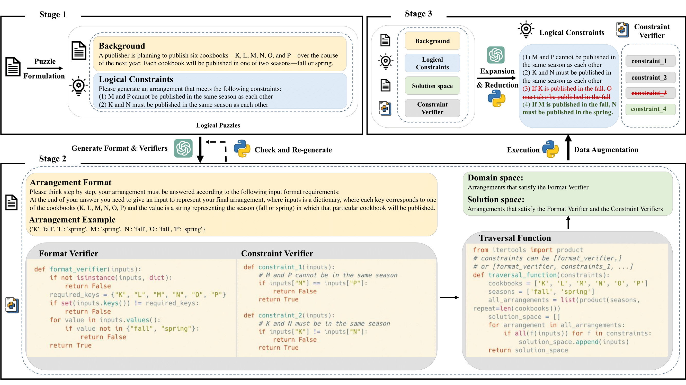

# AutoLogi

This repository contains the official implementation for the paper [**"AutoLogi: Automated Generation of Logic Puzzles for Evaluating Reasoning Abilities of Large Language Models"**](https://arxiv.org/abs/2502.16906).

## Basic Information



Our automated method for synthesizing open-ended logic puzzles consists of three stages: Stage 1 formulates logic puzzles by extracting background information and constraints from a source corpus. Stage 2 uses large language models (LLMs) to generate verifiers, which are programs that check puzzle solutions and ensure correct formatting. Stage 3 augments the puzzles by adding or removing constraints to create varying difficulty levels. All three stages leverage powerful LLMs, such as GPT-4, for generation.

|  | D<sub>testing</sub> | D<sub>training</sub> | D<sub>dpo</sub>(7b) | D<sub>dpo</sub>(72b) | D<sub>sft</sub>(72b) |
|:---:|:-------------------:|:-------------------:|:-------------------:|:--------------------:|:-------------------:|
| **EN** | 1575                | 5064                | 2877                | 2349                 | 3724                |
| **CN** | 883                 | 1675                | 901                 | 621                  | 1170                |

The table above presents a detailed statistical overview of the synthetic test set (D<sub>testing</sub>) and various training datasets used. 

## DATA

### Benchmark Data
AutoLogi benchmark evaluation data is available in:
- `/testing-data/AutoLogi_en.jsonl` (English)
- `/testing-data/AutoLogi_cn.jsonl` (Chinese)

### Training Data
Located in `/training-data/`:
- `source_corpus_cn.jsonl` and `source_corpus_en.jsonl`: Source data as input
- `synthesized_data_cn.jsonl` and `synthesized_data_en.jsonl`: Data generated from source corpus using our synthesis method
- SFT and DPO data obtained through rejection-sampling using:
  - Qwen2.5-72b-instruct
  - Qwen2.5-7b-instruct

For detailed implementation of the rejection-sampling process, please refer to our paper.

## Evaluation

### Quick Start

#### Step 1: Generate Model Responses
Use the 'prompt' field in `/testing-data/AutoLogi_en.jsonl` and `/testing-data/AutoLogi_cn.jsonl` as input for your model. Store the model outputs in the 'gen' field as a list containing a string. See `/model_output/qwen2.5_72b_instruct_response_example_en.jsonl` for the expected format.

#### Step 2: Run Evaluation
```bash
cd /AutoLogi
python evaluation/eval.py --input_data ./model_output/qwen2.5_72b_instruct_response_example_en.jsonl --output_dir ./eval_results/
```
## Synthesize
The implementation of our synthesis method is in /synthsize/.

**Note**: Before running the code, you need to modify the API configurations according to your setup in function `utils/call_openai` and set the corresponding environment variables(`OPENAI_API_KEY`).

### Quick Start

Run the complete pipeline:
```bash
cd AutoLogi 
bash ./synthesize/script/en/pipeline.sh
```

### Stage-wise Execution

You can also run individual stages, such as:

```bash
# Stage 3 Reduce
bash /synthesize/script/en/delete.sh

# Stage 3 Augmentation  
bash /synthesize/script/en/add.sh
```

### Create Custom AutoLogi Training Set

1. Place your data in  `./training-data/` following the format of source_corpus_en.jsonl (must include 'question' and 'id' fields)
2. Modify the NAME variable in `./synthesize/script/en/pipeline.sh` to match your dataset name
3. Run the pipeline as described above

## Leaderboard
The "Overall Scores" column represents the arithmetic mean of the model's scores on "AutoLogi(Augmented) EN" and "AutoLogi(Augmented) CN".

| **Model**                 | **AutoLogi(Augmented) EN** | **AutoLogi(Augmented) CN** | **Overall Scores** |
|:--------------------------|:--------------------------:|:--------------------------:|:------------------:|
| Qwen2.5-7b-instruct       | 43.64 ±1.25                | 42.08 ±1.50                | 42.86              |
| Qwen2.5-72b-instruct      | 68.18 ±0.77                | 63.92 ±0.56                | 66.05              |
| LLama3.1-8b-instruct      | 37.96 ±1.41                | 23.69 ±1.33                | 30.83              |
| LLama3.1-70b-instruct     | 62.47 ±0.96                | 53.77 ±0.95                | 58.12              |
| LLama3.1-405b-instruct    | 70.43 ±1.39                | 65.39 ±1.07                | 67.91              |
| GPT-3.5-Turbo             | 35.25 ±0.81                | 34.47 ±1.39                | 34.86              |
| GPT-4o-2024-08-06         | **72.61** ±0.76            | 66.70 ±1.25                | 69.66              |
| Claude-3.5-sonnet         | 72.53 ±0.82                | **68.24** ±0.98                | **70.39**          |


## Citation

The code in this repository is developed from the papers below. Please cite it if you find the repository helpful.
```
@misc{zhu2025autologiautomatedgenerationlogic,
      title={AutoLogi: Automated Generation of Logic Puzzles for Evaluating Reasoning Abilities of Large Language Models}, 
      author={Qin Zhu and Fei Huang and Runyu Peng and Keming Lu and Bowen Yu and Qinyuan Cheng and Xipeng Qiu and Xuanjing Huang and Junyang Lin},
      year={2025},
      eprint={2502.16906},
      archivePrefix={arXiv},
      primaryClass={cs.CL},
}
```